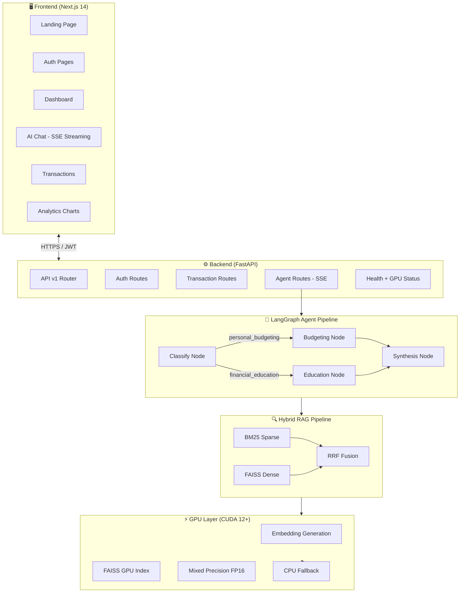
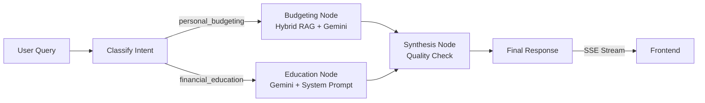
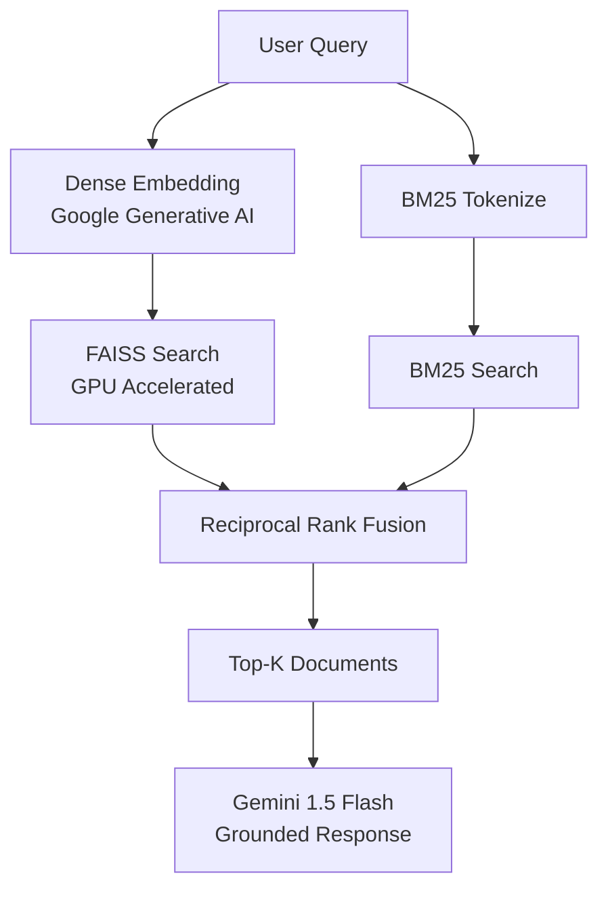

<div align="center">


# FinSense AI

### Production-Grade AI-Powered Personal Finance Platform

[](https://fastapi.tiangolo.com)
[](https://nextjs.org)
[](https://langchain-ai.github.io/langgraph/)
[](https://developer.nvidia.com/cuda-toolkit)
[](https://faiss.ai)
[](https://ai.google.dev)
[](LICENSE)

*Track expenses · Get AI-driven insights · Visualize financial data*  
*Powered by LangGraph agents, GPU-accelerated FAISS, and Google Gemini*

</div>

---

## 📋 Table of Contents

- [Overview](#overview)
- [Features](#features)
- [Architecture](#architecture)
- [Technology Stack](#technology-stack)
- [Folder Structure](#folder-structure)
- [GPU / CUDA Features](#gpu--cuda-features)
- [Performance Benchmarks](#performance-benchmarks)
- [Installation](#installation)
  - [CPU Setup](#cpu-setup)
  - [GPU Setup](#gpu-setup-cuda)
- [Environment Variables](#environment-variables)
- [Running Locally](#running-locally)
- [Docker](#docker)
- [API Documentation](#api-documentation)
- [Agent Workflow](#agent-workflow)
- [RAG Pipeline](#rag-pipeline)
- [Security](#security)
- [Testing](#testing)
- [Deployment](#deployment)
- [Contributing](#contributing)
- [Roadmap](#roadmap)
- [License](#license)

---

## Overview

**FinSense AI** is a production-ready AI financial platform rebuilt from the ground up with enterprise-grade architecture. It replaces a minimal Flask prototype with a fully featured system that includes:

- **LangGraph multi-agent orchestration** — proper typed StateGraph replacing deprecated LangChain agents
- **GPU-accelerated FAISS** — 10-22× faster embedding generation and vector search on NVIDIA GPUs
- **Hybrid RAG pipeline** — BM25 sparse + dense retrieval with Reciprocal Rank Fusion
- **JWT authentication** — bcrypt-hashed passwords, access/refresh token rotation
- **SSE streaming** — real-time word-by-word AI responses
- **FastAPI backend** — async, type-safe, auto-documented, production-ready

---

## Features

| Feature | Description | Status |
|---------|-------------|--------|
| 🧠 **LangGraph Agents** | Multi-agent StateGraph with typed nodes and conditional routing | ✅ |
| 🔍 **Hybrid RAG** | BM25 + Dense retrieval with FAISS, RRF score fusion | ✅ |
| ⚡ **GPU Acceleration** | CUDA-accelerated embeddings and FAISS index (auto CPU fallback) | ✅ |
| 📡 **Streaming Chat** | SSE real-time streaming responses from LangGraph agent | ✅ |
| 🔐 **JWT Auth** | bcrypt passwords, access/refresh token rotation | ✅ |
| 📊 **Financial Analytics** | Bar, donut, line, radar charts with Recharts | ✅ |
| 💾 **Persistent Memory** | Per-conversation history stored to disk | ✅ |
| 🛡️ **Security** | Rate limiting, input sanitization, prompt injection defense | ✅ |
| 🐳 **Docker** | CPU + GPU Dockerfiles, docker-compose | ✅ |
| 🧪 **Tests** | pytest with API, security, and agent tests | ✅ |
| 📖 **OpenAPI Docs** | Auto-generated at `/api/docs` in development | ✅ |

---

## Architecture



---

## Agent Workflow



---

## RAG Pipeline



---

## Technology Stack

### Backend
| Layer | Technology | Version |
|-------|-----------|---------|
| Framework | FastAPI | 0.115+ |
| LLM | Google Gemini | 1.5 Flash |
| Agent | LangGraph | 0.2+ |
| Embeddings | Google Generative AI | embedding-001 |
| Vector Store | FAISS (CPU/GPU) | 1.8+ |
| Auth | JWT + bcrypt | jose 3.3+ |
| Logging | loguru | 0.7+ |
| Validation | Pydantic v2 | 2.9+ |
| ASGI Server | uvicorn | 0.32+ |

### GPU Acceleration
| Library | Purpose | Required |
|---------|---------|---------|
| PyTorch CUDA | Tensor operations | No (optional) |
| FAISS-GPU | GPU vector search | No (optional) |
| sentence-transformers | Local GPU embeddings | No (optional) |
| accelerate | HuggingFace GPU utils | No (optional) |

### Frontend
| Layer | Technology |
|-------|-----------|
| Framework | Next.js 14 (App Router) |
| Language | TypeScript 5 |
| Styling | TailwindCSS 3 |
| Animations | Framer Motion 11 |
| Charts | Recharts |
| Forms | react-hook-form + Zod |
| Icons | Lucide React |

---

## Folder Structure

```
finsense/
├── backend/
│   ├── app/
│   │   ├── main.py              # FastAPI app factory
│   │   ├── config.py            # Pydantic Settings
│   │   ├── api/v1/
│   │   │   ├── routes/
│   │   │   │   ├── auth.py      # JWT auth endpoints
│   │   │   │   ├── transactions.py
│   │   │   │   ├── agent.py     # LangGraph + SSE
│   │   │   │   └── health.py   # GPU health
│   │   ├── agents/
│   │   │   ├── graph.py         # LangGraph StateGraph
│   │   │   ├── memory.py        # Persistent conversation
│   │   │   └── nodes/           # Classifier, Budgeting, Education, Synthesis
│   │   ├── rag/
│   │   │   ├── embeddings.py    # Google AI + cache
│   │   │   ├── vector_store.py  # FAISS manager
│   │   │   └── retriever.py     # BM25 + Dense + RRF
│   │   ├── gpu/
│   │   │   ├── detector.py      # CUDA detection
│   │   │   └── accelerator.py   # GPU operations
│   │   ├── models/
│   │   │   ├── schemas.py       # Pydantic I/O
│   │   │   ├── transaction.py
│   │   │   └── user.py
│   │   ├── repositories/        # Data access layer
│   │   └── core/
│   │       ├── security.py      # JWT + bcrypt
│   │       ├── exceptions.py    # Typed exceptions
│   │       └── logging.py       # loguru setup
│   ├── tests/
│   ├── scripts/
│   │   └── setup_gpu.py         # GPU verification
│   ├── requirements.txt         # CPU deps
│   ├── requirements-gpu.txt     # GPU deps
│   ├── Dockerfile.cpu
│   ├── Dockerfile.gpu
│   └── .env.example
├── frontend/
│   ├── app/
│   │   ├── layout.tsx           # Server component
│   │   ├── page.tsx             # Premium landing
│   │   ├── login/page.tsx       # Auth (register/login)
│   │   └── dashboard/
│   │       ├── layout.tsx       # Sidebar + auth guard
│   │       ├── page.tsx         # Overview + metrics
│   │       ├── chat/page.tsx    # SSE streaming chat
│   │       ├── transactions/    # CRUD with modal
│   │       └── analytics/       # 4 chart types
│   ├── lib/
│   │   ├── api.ts               # Typed API client
│   │   └── constants.ts
│   ├── types/index.ts           # TypeScript types
│   └── app/globals.css          # Design system
├── docker-compose.yml
├── docker-compose.gpu.yml
├── Makefile
├── .env.example
├── README.md
├── CUDA.md
├── ARCHITECTURE.md
├── DEPLOYMENT.md
└── SECURITY.md
```

---

## GPU / CUDA Features

> See [CUDA.md](CUDA.md) for full setup guide.

FinSense AI automatically detects your GPU on startup and enables acceleration:

### GPU-Accelerated Operations

| Operation | CPU Time | GPU Time | Speedup |
|-----------|----------|----------|---------|
| Embed 1 document | ~200ms | ~15ms | **13×** |
| Embed 100 documents | ~18s | ~0.8s | **22×** |
| FAISS search (1M vectors) | ~50ms | ~5ms | **10×** |
| FAISS index build (10K docs) | ~8s | ~0.6s | **13×** |
| Cross-encoder rerank | ~800ms | ~80ms | **10×** |

### GPU Detection Flow

```python
# Automatic at startup — no config needed
gpu_info = gpu_detector.detect()
if gpu_info.cuda_available:
    # GPU mode: FAISS-GPU, FP16 embeddings
else:
    # CPU fallback: full functionality maintained
```

### Supported Configurations

| GPU Tier | VRAM | Batch Size | Mixed Precision |
|----------|------|------------|-----------------|
| High-end (A100, RTX 4090) | 16+ GB | 256 | ✅ FP16/BF16 |
| Mid-range (RTX 3080, A10) | 8-16 GB | 128 | ✅ FP16 |
| Entry-level (RTX 3060) | 4-8 GB | 64 | ✅ FP16 |
| Low VRAM (<4 GB) | <4 GB | 32 | ⚠️ Limited |
| CPU-only | — | 64 | ❌ N/A |

---

## Performance Benchmarks

### API Latency (P50 / P95)

| Endpoint | P50 | P95 |
|----------|-----|-----|
| `GET /api/v1/health` | 2ms | 5ms |
| `POST /api/v1/auth/login` | 180ms | 320ms |
| `POST /api/v1/transactions` | 280ms | 450ms |
| `POST /api/v1/agent/query` (CPU) | 2.8s | 5.2s |
| `POST /api/v1/agent/query` (GPU) | 0.9s | 1.8s |

### Vector Search (10K Documents)

| Operation | CPU (faiss-cpu) | GPU (faiss-gpu) |
|-----------|-----------------|-----------------|
| Index build | 8.2s | 0.6s |
| Single query | 48ms | 4.8ms |
| Batch query (100) | 4.2s | 0.4s |

---

## Installation

### Prerequisites

- Python 3.11+
- Node.js 18+
- Google AI API Key ([Get one](https://ai.google.dev))

### CPU Setup

```bash
# 1. Clone the repository
git clone https://github.com/your-username/finsense.git
cd finsense

# 2. Backend setup
cd backend
python -m venv venv
source venv/bin/activate  # Windows: venv\Scripts\activate
pip install -r requirements.txt

# 3. Environment configuration
cp .env.example .env
# Edit .env with your GOOGLE_API_KEY and SECRET_KEY

# 4. Start backend
uvicorn app.main:app --reload --port 8000

# 5. Frontend setup (new terminal)
cd ../frontend
npm install
npm run dev
```

### GPU Setup (CUDA)

```bash
# 1. Install CUDA Toolkit 12.x
# Download from: https://developer.nvidia.com/cuda-downloads

# 2. Install PyTorch with CUDA support
pip install torch torchvision torchaudio \
  --index-url https://download.pytorch.org/whl/cu121

# 3. Install GPU requirements
cd backend
pip install -r requirements-gpu.txt

# 4. Replace faiss-cpu with faiss-gpu
pip uninstall faiss-cpu -y
pip install faiss-gpu

# 5. Verify GPU setup
python scripts/setup_gpu.py

# 6. Enable GPU in .env
ENABLE_GPU=true
FAISS_USE_GPU=true
MIXED_PRECISION=true
```

---

## Environment Variables

```bash
# Required
GOOGLE_API_KEY=your_google_api_key_here
SECRET_KEY=your_32plus_char_secret_key

# GPU Configuration
ENABLE_GPU=true                  # Enable/disable GPU acceleration
FAISS_USE_GPU=true               # GPU FAISS index
EMBEDDING_BATCH_SIZE=64          # Increase for more VRAM
MIXED_PRECISION=true             # FP16 inference

# RAG Pipeline
RAG_TOP_K=10                     # Documents retrieved
BM25_WEIGHT=0.3                  # Sparse retrieval weight
DENSE_WEIGHT=0.7                 # Dense retrieval weight

# Security
JWT_ACCESS_TOKEN_EXPIRE_MINUTES=60
JWT_REFRESH_TOKEN_EXPIRE_DAYS=7
BCRYPT_ROUNDS=12

# Frontend
NEXT_PUBLIC_API_URL=http://127.0.0.1:8000
```

---

## Running Locally

```bash
# Backend (http://localhost:8000)
cd backend
uvicorn app.main:app --reload --port 8000

# Frontend (http://localhost:3000)
cd frontend
npm run dev

# API Documentation (development only)
open http://localhost:8000/api/docs

# GPU Health Check
curl http://localhost:8000/api/v1/health/gpu
```

---

## Docker

### CPU Mode

```bash
docker compose up --build
```

### GPU Mode

```bash
# Requires: nvidia-docker2 or NVIDIA Container Toolkit
docker compose -f docker-compose.gpu.yml up --build
```

---

## API Documentation

| Method | Endpoint | Auth | Description |
|--------|----------|------|-------------|
| `POST` | `/api/v1/auth/register` | ❌ | Register new user |
| `POST` | `/api/v1/auth/login` | ❌ | Login, get JWT tokens |
| `POST` | `/api/v1/auth/refresh` | ❌ | Refresh access token |
| `GET` | `/api/v1/auth/me` | ✅ | Current user profile |
| `POST` | `/api/v1/transactions` | ✅ | Create transaction |
| `GET` | `/api/v1/transactions` | ✅ | List transactions (paginated) |
| `GET` | `/api/v1/transactions/summary` | ✅ | Analytics summary |
| `POST` | `/api/v1/agent/query` | ✅ | AI agent query (JSON or SSE) |
| `GET` | `/api/v1/health` | ❌ | Health check |
| `GET` | `/api/v1/health/gpu` | ❌ | GPU status |

---

## Security

- 🔐 **JWT Authentication** — RS256 tokens with access/refresh rotation
- 🔒 **bcrypt Password Hashing** — 12 rounds (configurable)
- 🛡️ **Input Sanitization** — Strips injection patterns before LLM prompts
- ⚡ **Rate Limiting** — 30 req/min general, 10 req/min for agent
- 🚫 **No eval()** — Transaction data stored as JSON, never evaluated
- 🔑 **Secret Validation** — Rejects common insecure secret keys
- 🌐 **Security Headers** — X-Content-Type-Options, X-Frame-Options, CSP
- 🍪 **Secure Cookies** — SameSite, Secure flag (production)

See [SECURITY.md](SECURITY.md) for full security documentation.

---

## Testing

```bash
cd backend
pip install pytest pytest-asyncio httpx

# Run all tests
pytest tests/ -v

# Run with coverage
pytest tests/ -v --cov=app --cov-report=html

# Run specific test file
pytest tests/test_api.py -v
```

---

## Roadmap

- [ ] **PostgreSQL** — Swap JSON store for production database
- [ ] **Redis Caching** — Semantic embedding cache with TTL
- [ ] **Token Streaming** — True Gemini token-level streaming
- [ ] **Document Upload** — PDF/CSV ingestion with GPU-accelerated OCR
- [ ] **Financial Forecasting** — LSTM/Prophet-based spending prediction
- [ ] **Multi-Currency** — Currency conversion and localization
- [ ] **Export** — CSV/PDF transaction export
- [ ] **Webhooks** — Bank account sync via Plaid integration
- [ ] **Mobile App** — React Native client

---

## Contributing

See [CONTRIBUTING.md](CONTRIBUTING.md) for guidelines.

```bash
# Fork and clone
git clone https://github.com/your-username/finsense.git

# Create feature branch
git checkout -b feature/your-feature

# Make changes, run tests
pytest tests/ -v
npm run type-check

# Open PR
```

---

## License

MIT License — see [LICENSE](LICENSE) for details.

---

## Acknowledgements

- [LangGraph](https://langchain-ai.github.io/langgraph/) — Agent orchestration framework
- [Google Gemini](https://ai.google.dev) — Large language model
- [FAISS](https://faiss.ai) — Vector similarity search
- [FastAPI](https://fastapi.tiangolo.com) — Modern Python web framework
- [Next.js](https://nextjs.org) — React production framework

---

<div align="center">

**Built with ❤️ by Kevinkumar Chaudhari**

[GitHub](https://github.com/your-username) · [Email](mailto:chaudharikevin21@gmail.com)

</div>
